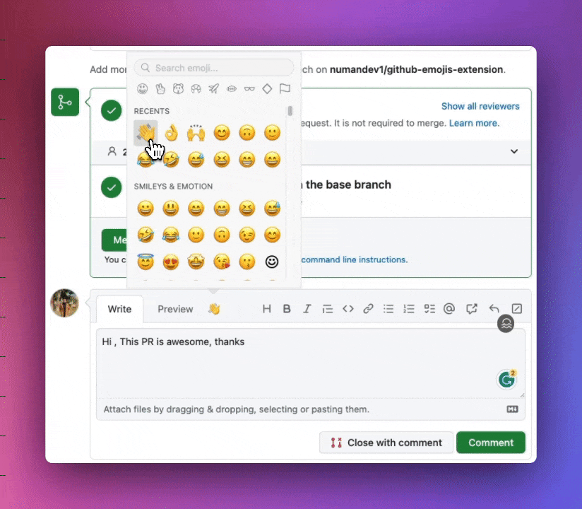

   

<!--  -->

<h3 align="center">Chrome extension for writing emojis in Github Issues/PR.</h3>

By this extension we can see emoji button on Githun <b>Markdown editor</b> where we can write emoji easily by this extension.

## Shortcut key

Macbook: `Cmd + '` or `ctrl + '`

Window: `ctrl + '`

## Made with

-  Made with **[React 18](https://reactjs.org)**
-  Made with [TypeScript](https://www.typescriptlang.org/) Support!
- 🛠️ [Devtools](https://developer.chrome.com/docs/extensions/mv3/devtools/) supported
-  Using **[Webpack](https://webpack.js.org/)**

### Would you like to support me?

<a href="https://www.youtube.com/@numandev?sub_confirmation=1"><a/>
 

## Consider supporting with a ⭐️ [Star on GitHub](https://github.com/numandev1/github-emojis-extension/stargazers)

## ⏳ Installation Instructions

### Chrome

#### Chrome Web Store

⚠ It is in review, soon it will be published, so you can follow temporary [Manual/Development](#manualdevelopment)

Go to the [Chrome Web Store page for _Github Emoji_](https://chrome.google.com/webstore/detail/ecldoejhjmekemajgjjalfgkhgmfjgcl) and install normally.

After installing, make sure to reload your Github URL or restart Chrome!

#### Manual/Development

1. Check if your [Node.js](https://nodejs.org/) version is >= **16**.
2. Clone this repository.
3. Run `npm install` to install the dependencies.
4. Start the server by `yarn start` or `npm run start`
5. Load your extension on Chrome following:
   1. Access `chrome://extensions/`
   2. Check `Developer mode`
   3. Click on `Load unpacked extension`
   4. Select the `build` folder.

## Contribution Guide

1. Follow [Manual/Development](#manualdevelopment) steps
2. Install [Extensions Reloader](https://chrome.google.com/webstore/detail/extensions-reloader/fimgfedafeadlieiabdeeaodndnlbhid) extension
3. As the main code lives in `src/pages/Content` so whenever we change in this directory, we have to press [Extensions Reloader](https://chrome.google.com/webstore/detail/extensions-reloader/fimgfedafeadlieiabdeeaodndnlbhid)
4. After pressing [Extensions Reloader](https://chrome.google.com/webstore/detail/extensions-reloader/fimgfedafeadlieiabdeeaodndnlbhid), we have to reload GitHub page for reflecting changes
5. Make changes and make PR 🚀

## Meta

Created by [Github@NumanDev1](https://github.com/numandev1?tab=followers)
